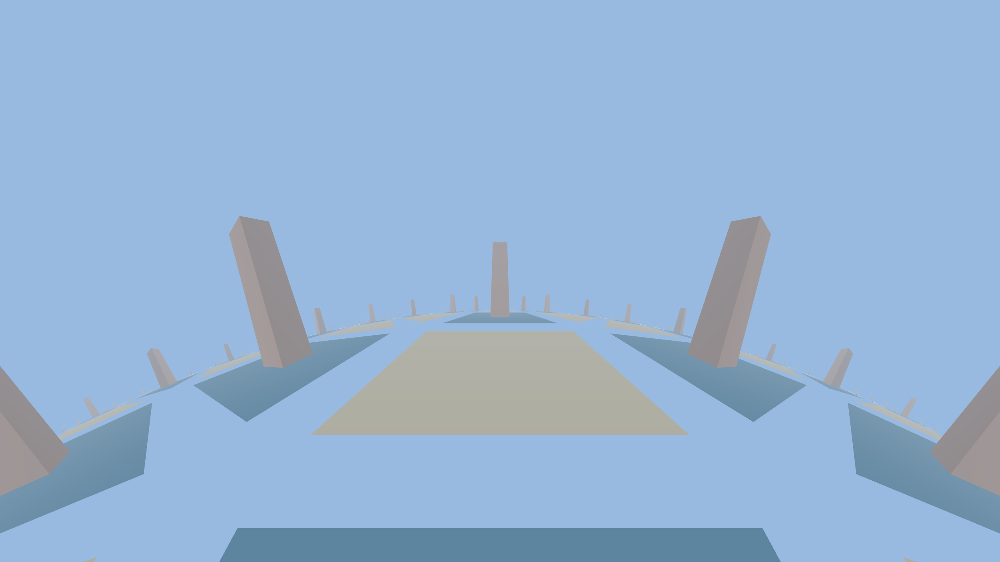

# Hyperbolic Explorer

A first-person Bevy game for walking around **hyperbolic 3-space (H³)**. The
world is a regular **{4,5} tiling** — four-sided tiles with *five* meeting at
every vertex, which is impossible in flat space and only fits because the floor
is negatively curved. Pillars rise from the tiles so you can feel the geometry
through parallax.

Inspired by [HackerPoet's HyperEngine](https://github.com/HackerPoet/HyperEngine)
(the non-Euclidean backend of *Hyperbolica*), reimplemented from scratch in Rust
+ Bevy with a custom WGSL projection shader.



## Run

```sh
cargo run --release
```

Controls:

| Key | Action |
| --- | --- |
| `W` `A` `S` `D` | move (true hyperbolic translation) |
| mouse | look around |
| arrow keys | turn / look (keyboard alternative) |
| `Esc` | quit |

Walk toward a pillar and back away: it shrinks far faster than in flat space.
Circle a vertex and you pass *five* tiles, not four. The floor always falls away
to a close, circular horizon — the visual signature of negative curvature.

## How it works

The renderer uses the **hyperboloid (Minkowski / Lorentz) model**. A point of H³
is a 4-vector `p = (x, y, z, w)` on the upper sheet of

```
<p, p> = x² + y² + z² − w² = −1,   w > 0.
```

- **Isometries** (translations and rotations) are Lorentz matrices — 4×4 matrices
  preserving that quadratic form. See [`src/hyperbolic.rs`](src/hyperbolic.rs).
  Movement multiplies the player's Lorentz frame by a *boost*; the view matrix is
  the exact Lorentz inverse `J Lᵀ J`.
- **The world** ([`src/world.rs`](src/world.rs)) is generated by reflecting the
  fundamental tile across its edges (a breadth-first walk over the {4,5} reflection
  group) and baking every tile's hyperboloid coordinates into one mesh. Vertex
  positions store the spatial part `(x, y, z)`; the shader recovers
  `w = √(1 + x²+y²+z²)`.
- **The projection** ([`assets/shaders/hyper.wgsl`](assets/shaders/hyper.wgsl)) is
  the elegant part. Transform a point into the camera frame with the Lorentz view
  matrix, then do an ordinary pinhole divide by the forward axis. Because the
  spatial part of a hyperboloid point *is* the geodesic direction from the camera,
  hyperbolic geodesics map to straight screen lines (the Beltrami–Klein property) —
  exactly what a rasterizer needs. Depth is `1/cosh(distance)`, which lines up with
  Bevy's reverse-Z buffer, and exponential fog in true geodesic distance gives the
  depth cueing.

## Tests

```sh
cargo test --bin hyperbolic-explorer
```

Checks that the transforms are genuine isometries, that the Lorentz inverse round-
trips, that an edge reflection lands a neighbor at exactly twice the inradius, and
that frame renormalization restores the metric after drift.
